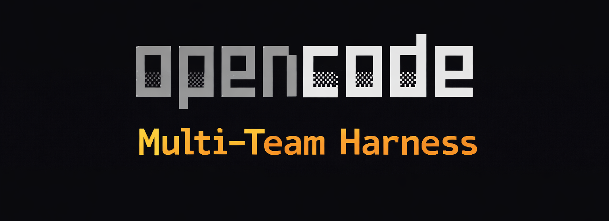

<p align="center">
  
</p>

[](README_pt.md)
[](https://github.com/AlyssonM/opencode-multi-harness/commits)
[](https://buymeacoffee.com/alyssonm)

# OpenCode Multi-Team Harness

This branch contains an OpenCode-native multi-team scaffold focused on hierarchical delegation:

- `orchestrator`
- `team leads`
- `workers`

The objective is to run a controlled multi-agent workflow in OpenCode with explicit task boundaries, durable expertise, and optional MCP integration.

## Repository Layout

- [`.opencode/crew/dev/multi-team.yaml`](./.opencode/crew/dev/multi-team.yaml)  
  Canonical dev crew topology (agentic coding profile).
- [`.opencode/crew/marketing/multi-team.yaml`](./.opencode/crew/marketing/multi-team.yaml)  
  Canonical marketing crew topology.
- [`.opencode/opencode.json`](./.opencode/opencode.json)  
  OpenCode config (permissions, MCP servers).
- [`opencode.example.json`](./opencode.example.json)  
  OpenCode config template for MCP/permission bootstrap.
- [`.opencode/agents/`](./.opencode/agents)  
  Active runtime agents (materialized by `use:crew`, ignored in git except `.gitkeep`).
- [`.opencode/crew/dev/agents/`](./.opencode/crew/dev/agents)  
  Canonical agents for dev crew.
- [`.opencode/skills/`](./.opencode/skills)  
  Reusable skills (`SKILL.md`) for delegation and mental model discipline.
- [`.opencode/tools/`](./.opencode/tools)  
  Custom tools callable by the model (currently `update-mental-model`).
- [`.opencode/plugins/`](./.opencode/plugins)  
  OpenCode runtime hooks (including optional session export).
- [`.opencode/crew/dev/expertise/`](./.opencode/crew/dev/expertise)  
  Canonical expertise files for dev crew.
- [`.opencode/scripts/validate-multi-team.mjs`](./.opencode/scripts/validate-multi-team.mjs)  
  Topology/reference validator for active crew config (`--config`, `OPENCODE_MULTI_CREW_CONFIG`, `OPENCODE_MULTI_CONFIG`, or active crew metadata).
- [specs/opencode-multi-team-plan.md](./specs/opencode-multi-team-plan.md)  
  Implementation plan and rollout phases.

## Agent Topology

Primary:

- `orchestrator`

Leads:

- `planning-lead`
- `engineering-lead`
- `validation-lead`

Workers:

- Planning: `repo-analyst`, `solution-architect`
- Engineering: `frontend-dev`, `backend-dev`
- Validation: `qa-reviewer`, `security-reviewer`

Task delegation is constrained through per-agent `permission.task` rules in each agent frontmatter.

## Custom Tool

Current custom tool:

- [update-mental-model.ts](./.opencode/tools/update-mental-model.ts)

It appends durable notes to the expertise file declared by each agent (typically `.opencode/crew/<crew>/expertise/<agent>-mental-model.yaml`) with category support and line-limit trimming.
Path resolution order: active crew config (`.opencode/.active-crew.json`) -> active agent prompt (`.opencode/agents/<agent>.md`) -> legacy fallback (`.opencode/expertise/<agent>-mental-model.yaml`).

## MCP

Configured in [`.opencode/opencode.json`](./.opencode/opencode.json):

- `context7`
- `brave-search`
- `firecrawl`

Brave Search MCP uses the official package `@brave/brave-search-mcp-server`.

## Install

```bash
git clone https://github.com/AlyssonM/multi-agents.git
cd multi-agents
npm --prefix .opencode install
npm --prefix .opencode run ocmh:install
```

Optional environment setup:

```bash
cp .env.sample .env
# then fill required values in .env (e.g. CONTEXT7_API_KEY, BRAVE_API_KEY, FIRECRAWL_API_KEY)
```

Verify OpenCode CLI is available:

```bash
if command -v opencode >/dev/null 2>&1; then
  opencode --version
else
  echo "OpenCode CLI not found. Install it first: https://opencode.ai/"
fi
```

## Get Started

Sync generated agents from canonical topology:

```bash
ocmh sync
```

Validate topology and references:

```bash
ocmh validate
```

Check drift (CI-friendly, no writes):

```bash
ocmh check:sync
```

Run environment doctor:

```bash
ocmh doctor
```

List available harness crews:

```bash
ocmh list:crews
```

Activate a crew (example: `marketing`):

```bash
ocmh use marketing
```

Clear active crew selection (deprovision runtime agents):

```bash
ocmh clear
```

Start OpenCode:

```bash
opencode
```

Enable optional Pi-like session export:

```bash
OPENCODE_MULTI_SESSION_EXPORT=1 opencode
```

Optional custom export path:

```bash
OPENCODE_MULTI_SESSION_EXPORT=1 \
OPENCODE_MULTI_SESSION_DIR=.opencode/crew/dev/sessions \
opencode
```

Suggested workflow:

1. Switch to `@orchestrator`.
2. Request a task that needs Planning -> Engineering -> Validation.
3. Confirm delegation path respects `permission.task`.
4. Ask an agent to persist a durable insight through `update-mental-model`.

## Quick Troubleshooting

Show CLI help:

```bash
ocmh --help
```

Run the runtime doctor:

```bash
ocmh doctor
```

Validate without materializing runtime changes:

```bash
ocmh validate --config .opencode/crew/dev/multi-team.yaml
```

## Notes

- Source of truth configs live per crew (`.opencode/crew/<crew>/multi-team.yaml`), not in `.opencode/` root.
- Root `.opencode/agents` is still required as active runtime mount point for the selected crew.
- Agent provisioning in `.opencode/agents` is done by file copy (`cpSync`), not symlink (`ln -s`).
- Optional session export plugin (`.opencode/plugins/session-export.ts`) writes:
  - default per active crew: `.opencode/crew/<crew>/sessions/<session-id>/...`
  - child: `.opencode/crew/<crew>/sessions/<root-session-id>/children/<child-session-id>/...`
  - can be overridden with `OPENCODE_MULTI_SESSION_DIR`
- Export is disabled by default and only runs with `OPENCODE_MULTI_SESSION_EXPORT=1`.
- Multi-crew harness selection:
  - crew folders supported at `.opencode/crew/<crew>/`
  - activate via `ocmh use <crew>`
  - `sync`/`validate` can target custom config via `--config`, `OPENCODE_MULTI_CREW_CONFIG` or `OPENCODE_MULTI_CONFIG`
- Authoring strategy:
  - treat `.opencode/crew/<crew>/multi-team.yaml` as source-of-truth
  - activate target crew with `ocmh use <crew>`
  - run `ocmh sync` after topology changes
  - run `ocmh check:sync` in CI/pre-commit to prevent drift
  - validate with `ocmh validate`
- keep `.opencode/opencode.json` aligned with runtime needs

## Contributor Checks

Validate runtime files:

```bash
ocmh check:runtime
```

Run smoke tests:

```bash
ocmh test:smoke
```

## Support & Sponsoring

<p align="center">
  
</p>

If this project helps you, consider supporting it:

- Buy Me a Coffee: https://buymeacoffee.com/alyssonm
